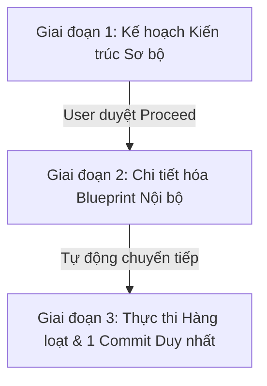

# Project Rules & Customizations

> **Nguồn quy tắc duy nhất (Single Source of Truth) cho mọi AI agent làm việc trên repo này** — Claude Code, Google Antigravity, hoặc bất kỳ agent nào khác. Không tạo bản sao của tệp này.

---

## PHẦN I: BẢN ĐỒ SỞ HỮU & TÀI LIỆU THIẾT KẾ (OWNERSHIP & DOCS)

### 1. Module Ownership Map
Mỗi tệp mã nguồn thuộc về **đúng một** module, và mỗi module có **đúng một** tài liệu thiết kế chính thức:

| Module | Tệp mã nguồn thuộc module | Tài liệu thiết kế |
|---|---|---|
| **Platform Shell** | `src/App.tsx`, `src/components/Dashboard.tsx`, `src/components/LoginPage.tsx`, `src/components/UserManagement.tsx`, `src/context/AuthContext.tsx`, `src/main.tsx` | [`DESIGN_PLATFORM_SHELL.md`](DESIGN_PLATFORM_SHELL.md) |
| **Process Designer** | `src/components/ProcessEditor.tsx`, `src/components/ProcessReader.tsx`, `src/components/BpmnModelerComponent.tsx`, `src/components/BpmnViewerComponent.tsx`, `src/components/BPMNGuide.tsx`, `src/utils/bpmnXmlGenerator.ts`, `src/utils/layout/*`, `src/bpmn-custom.d.ts` | [`DESIGN_PROCESS_DESIGNER.md`](DESIGN_PROCESS_DESIGNER.md) |
| **Form Designer** | `src/components/FormBuilder.tsx`, `src/components/print/PrintBlankForm.tsx` | [`DESIGN_FORM_DESIGNER.md`](DESIGN_FORM_DESIGNER.md) |
| **Form Operations** | `src/components/FormFiller.tsx`, `src/components/FormManager.tsx`, `src/components/SubmissionManager.tsx`, `src/components/print/PrintFilledForm.tsx`, `src/utils/formUtils.ts` | [`DESIGN_FORM_OPERATIONS.md`](DESIGN_FORM_OPERATIONS.md) |
| **Report Builder** | *(Components TBD)* | [`DESIGN_REPORT_BUILDER.md`](DESIGN_REPORT_BUILDER.md) |
| **Backend & Persistence** | `server.cjs`, `api/index.js` | [`DESIGN_BACKEND.md`](DESIGN_BACKEND.md) |
| **Design System** | `src/index.css`, `src/print.css`, `src/App.css` | [`DESIGN_UI_UX.md`](DESIGN_UI_UX.md) |

#### Shared types (`src/types.ts`)
Mỗi interface dùng chung có **đúng một** tài liệu chủ:
- `Process`, `ProcessStep`, `SOPSignOff`, `SOPSignOffs`, `FormField`, `FormDesignerField`, `RadioOption` ➔ [`DESIGN_PROCESS_DESIGNER.md`](DESIGN_PROCESS_DESIGNER.md)
- `FormTemplateISO`, `LayoutBlockISO`, `FormFieldISO`, `FormRevisionEntry`, `MatrixConfigISO`, `TableColumnConfig`, `TableRowConfig`, `SubtableColumn`, `ColumnSummaryRowConfig`, `TitleFormatISO`, `LinkedWorkStepInfo` ➔ [`DESIGN_FORM_DESIGNER.md`](DESIGN_FORM_DESIGNER.md)
- `Submission`, `SubmissionFieldSnapshot` ➔ [`DESIGN_FORM_OPERATIONS.md`](DESIGN_FORM_OPERATIONS.md)
- `ReportTemplateISO`, `ReportBlockConfig`, `ReportBlockType`, `ReportRevisionEntry`, `ReportDataModel`, `FieldEvaluationResult`, `ReportFieldRuleOverride` ➔ [`DESIGN_REPORT_BUILDER.md`](DESIGN_REPORT_BUILDER.md)
*(Lưu ý: User, Role, Permissions Matrix nằm trong `AuthContext.tsx` và thuộc `DESIGN_PLATFORM_SHELL.md`)*

### 2. Kỷ luật Tài liệu Thiết kế (Documentation Discipline)
- **Đọc trước khi sửa (Read Before Edit):** Trước khi can thiệp vào file mã nguồn, BẮT BUỘC đọc tài liệu thiết kế của module đó trước. Chỉ đọc symbol liên quan, không đọc cả file. Nếu tài liệu mâu thuẫn mã nguồn: mã nguồn là đúng, cập nhật tài liệu ngay.
- **Cập nhật sau khi sửa (Update After Edit):** Bắt buộc cập nhật tài liệu thiết kế trong cùng commit:
  1. *Cập nhật nội dung:* Data model, interface contracts, flow, technical debt bị ảnh hưởng.
  2. *Header Block `Verified At Commit`:* Ghi rõ ngày và tên các mục đã kiểm chứng thực tế:
     `| **Verified At Commit** | (2026-09-18) — FormBuilderProps linkedWorkSteps & UI hint verified against source |`
  3. *Change Log:* Chỉ ghi thay đổi kiến trúc/schema/invariant (tối đa ~15 dòng, xóa dòng cũ khi vượt, không ghi SHA commit, không ghi UI cosmetic).
- **Cấm ghi số dòng (No Line Numbers):** Tuyệt đối không ghi số dòng (`line 45-60`) vào tài liệu vì sẽ lệch khi commit. Luôn tham chiếu bằng tên symbol (`interface FormBuilderProps`, `function extractLinkedWorkSteps`).

---

## PHẦN II: TIÊU CHUẨN GIAO DIỆN & KIẾN TRÚC MÃ NGUỒN (UI/UX & CODE QUALITY)

### 3. Tuân thủ Master Design (UI/UX Compliance)
- **CSS Tokens & Utility Classes:** Bắt buộc dùng CSS variables (`var(--primary)`, `var(--neutral-bg)`, …) và utility class (`.paper-card`, `.btn`) trong `src/index.css`. CẤM hardcode inline mã màu (ví dụ `#10a3a3`).
- **Nghiêm cấm `window.confirm()` / `alert()`:** Mọi xác nhận BẮT BUỘC dùng component dùng chung `ConfirmModal` (`src/components/common/ConfirmModal.tsx`).
- **Chuyển đổi lũy tiến (Progressive Adoption):** Khi sửa một component có `window.confirm()` cũ, bắt buộc chuyển toàn bộ sang `ConfirmModal`.
- **Lan truyền đồng bộ (Propagation):** Đổi cấu trúc HTML/class chuẩn phải cập nhật đồng bộ các component tương tự. Thêm CSS token mới phải ghi nhận vào `DESIGN_UI_UX.md`.

### 4. Tiêu chuẩn Kiến trúc & Chất lượng Mã nguồn (Architecture Invariants)
- **4.1 Tách biệt Logic Thuần túy (Pure Utility Extraction — Rule 13.8):** Mọi logic tính toán, mảng (sort, filter, reorder), format, hoặc chuẩn hóa schema KHÔNG phụ thuộc React state/JSX BẮT BUỘC phải tách thành pure function trong module utility (`src/utils/formUtils.ts`, `src/utils/bpmnXmlGenerator.ts`), có types đầy đủ. Component monolith chỉ đảm nhận hiển thị và event delegation.
- **4.2 Triệt tiêu Mã chết (Dead-Code Pruning — Rule 13.7):** Khi nâng cấp hoặc thay thế tính năng, BẮT BUỘC rà soát toàn bộ call-sites và xóa sạch hàm cũ, state cũ, props, hoặc biến không dùng (`TS6133`) trong cùng 1 commit. Cấm để lại orphaned code.
- **4.3 Kiểm soát Phình to Monolith (Monolith Guard — Rule 13.9):** Với các file monolith lớn (>3.000 dòng, đặc biệt `FormBuilder.tsx`), khi thêm phân hệ khép kín mới (modal lớn, inspector panel độc lập) có khối lượng dự kiến >150 dòng JSX, BẮT BUỘC tách sub-component riêng (`src/components/form/`). Không tự ý refactor diện rộng ngoài phạm vi task để đảm bảo zero regression.

### 5. Quy tắc An toàn khi Sửa mã (Safe Patching Invariants)
- **5.1 Đọc trước khi viết replacement (Rule 12.1):** Luôn `view_file` đúng vùng cần sửa và copy chính xác whitespace/indentation. CẤM viết `TargetContent` từ trí nhớ.
- **5.2 Ưu tiên `replace_file_content` gốc (Rule 12.2):** Chỉ dùng Python script khi target string trùng lặp nhiều nơi hoặc cần regex. Khi dùng Python, ưu tiên `content.replace(exact_old, exact_new, 1)`, cấm index slicing.
- **5.3 Giới hạn Chunk Patch < 50 dòng (Rule 12.6):** Trên file monolith lớn (>2.000 dòng), mỗi lần thay thế KHÔNG ĐƯỢC VƯỢT QUÁ 50 dòng code, luôn bao gồm tối thiểu 3 dòng context độc nhất trước và sau.
- **5.4 Kiểm tra TypeScript tức thì sau mỗi file (Rule 12.3):** Sau khi sửa xong mỗi file `.ts`/`.tsx`, BẮT BUỘC chạy ngay `npx tsc --noEmit`. Lỗi phát sinh phải sửa dứt điểm ngay tại file đó trước khi sang file tiếp theo.
- **5.5 Không chạy Python inline chứa JSX (Rule 12.4):** Khi script chứa `()`, `=>`, `{}`, `<>`, cấm chạy `python -c "..."` trên PowerShell. Bắt buộc lưu ra file `.py` tạm rồi thực thi.

---

## PHẦN III: QUY TRÌNH 2 GIAI ĐOẠN & ATOMIC SINGLE COMMIT (WORKFLOW)

### 6. Quy trình Lập Kế hoạch & Thực thi 2 Giai đoạn (Two-Stage Planning)



#### Giai đoạn 1: Kế hoạch Kiến trúc Sơ bộ (Trước khi nhận `Proceed`)
- **Mục tiêu:** Cung cấp bức tranh tổng quan để Người dùng (The Thinker) duyệt nhanh định hướng kiến trúc.
- **Nội dung `implementation_plan.md`:**
  - Tóm tắt vấn đề & Nguyên nhân gốc (Root Cause).
  - Danh sách file ảnh hưởng (`[MODIFY]`, `[NEW]`, `[DELETE]`).
  - Hướng tiếp cận logic, breaking change, schema impact & Mockup giao diện (nếu có UI).
  - Kế hoạch kiểm chứng (Verification Plan).
- **RÀNG BUỘC CỨNG (NEVER):** **TUYỆT ĐỐI CẤM viết các đoạn code thay thế dài dòng** ở giai đoạn này để tránh kéo dài thời gian review và gây nhiễu định hướng.
- **Hành động:** Đặt `RequestFeedback: true` và dừng lại chờ Người dùng bấm `Proceed`.

#### Giai đoạn 2: Chi tiết hóa Blueprint Nội bộ (Ngay sau khi nhận `Proceed`)
- **Mục tiêu:** Chuẩn bị sẵn sàng 100% code blocks, rà soát dead-code và unused variables trước khi chạm vào mã nguồn thực tế.
- **Hành động bắt buộc (TUYỆT ĐỐI KHÔNG sửa code ngay):**
  1. Đọc `SESSION_LOG.md` (mục Bài học Tích lũy) đối chiếu các file cần sửa.
  2. Đọc chính xác các vùng mã nguồn thực tế bằng `view_file`.
  3. Soạn Exact Code Blocks hoàn chỉnh (import, hook, logic, JSX).
  4. Cập nhật blueprint vào `implementation_plan.md` với **`RequestFeedback: false`**.
- **Chuyển tiếp tự động:** Ngay sau khi lưu blueprint, tự động chuyển thẳng sang Giai đoạn 3 mà **KHÔNG dừng lại hỏi Người dùng lần 2** (trừ trường hợp phát sinh breaking change ngoài dự kiến).

#### Giai đoạn 3: Thực thi Hàng loạt một lượt (Batch Execution)
1. Chỉnh sửa tuần tự các file mã nguồn theo đúng blueprint (tuân thủ Rule Chunk < 50 dòng).
2. Chạy `npx tsc --noEmit` sau mỗi file; chạy `npm run build` ở bước cuối xác nhận Vite bundle pass 100%.
3. Cập nhật tài liệu thiết kế module tương ứng (`DESIGN_*.md`).
4. Chạy `python scripts/measure_session.py <conversation-id>`, dán Performance Scorecard vào `walkthrough.md`, phân tích lỗi và cập nhật `SESSION_LOG.md`.
5. **BƯỚC CUỐI CÙNG:** Chạy đúng **1 lần commit & push nguyên tử duy nhất** theo Mục 7.

### 7. Quy trình Native Git Push Chuẩn (Atomic Single Commit)
- **Ràng buộc bất biến:** Toàn bộ Code + Tài liệu thiết kế + `SESSION_LOG.md` PHẢI được gộp vào **ĐÚNG 1 COMMIT DUY NHẤT**. Tuyệt đối CẤM tạo commit thứ hai sau khi push để triệt tiêu việc kích hoạt deploy dư thừa trên Vercel / CI.
- **Lệnh thực thi duy nhất trong PowerShell** (`WaitMsBeforeAsync: 25000` ms):
  ```powershell
  git commit -a -m "<message>"; git push origin main; git log -n 1 --oneline
  ```
- *Nếu có file mới chưa tracked:* `git add <files cụ thể>; git commit -m "..."; git push origin main; git log -n 1 --oneline`.
- *Tự dọn lock (nếu có sự cố):* `Remove-Item -Path .git\index.lock -Force -ErrorAction SilentlyContinue`.

---

## PHẦN IV: VÒNG LẶP HỌC HỎI & BỘ NHỚ PHIÊN (CONTINUOUS IMPROVEMENT)

### 8. Vòng lặp Tự học Liên tục (Continuous Improvement Loop)
Bộ nhớ phiên duy nhất là [`SESSION_LOG.md`](SESSION_LOG.md) tại repo root:
- **Trước khi làm (Giai đoạn 2):** Bắt buộc đọc `## Bài học Tích lũy` để phòng ngừa lỗi cũ lặp lại.
- **Trước khi push (Giai đoạn 3):**
  1. *Đo KPIs bằng script:* Chạy `python scripts/measure_session.py <conversation-id>` (không đếm thủ công — Rule 13.6 Script-First). Dán Scorecard vào `walkthrough.md`.
  2. *Phân tích lỗi (Reasoning task):* Phân loại lỗi theo Error Taxonomy:
     - `CTX`: Đọc sai ngữ cảnh, lệch whitespace.
     - `TOOL`: Dùng tool sai, index slicing, inline python parse error.
     - `LOGIC`: Lỗi điều kiện, thiếu null-check.
     - `SCOPE`: Sót file, sót context.
     - `ENV`: Mạng, lock, timeout.
     - `BLOAT`: Phình to mã, sót mã chết (`TS6133`), không tách utility.
  3. *Ghi nhận:* Thêm entry mới vào đầu `## Nhật ký Phiên` (giữ tối đa 10 entries gần nhất), cập nhật `## Bài học Tích lũy` (giữ tối đa 20 entries).
  4. *Quy tắc tiến hóa (Rule Evolution):* Khi cùng 1 loại lỗi lặp lại **≥ 2 lần**, BẮT BUỘC đề xuất cập nhật thành quy tắc cố định trong `AGENTS.md`.

### 9. Master Index (`README.md`)
Agent PHẢI cập nhật [`README.md`](README.md) nếu: thêm module chức năng mới, thay đổi Tech Stack lõi, hoặc thay đổi quy trình khởi chạy hệ thống.
