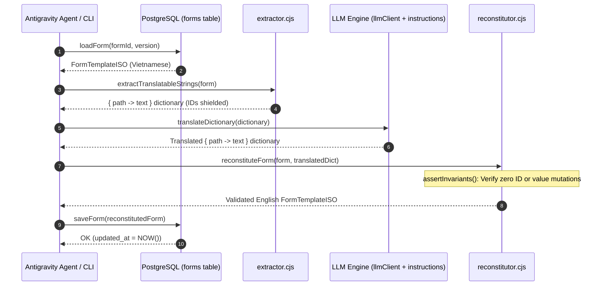

# Form Translator — Module Design Document

---

## Header Block

| Field | Value |
|---|---|
| **Module Name** | Form Translator |
| **Status** | Active Development |
| **Document Version** | 1.2 |
| **Verified At Commit** | (2026-09-20) — Context-Driven Web Search Grounding, domain-agnostic citation schema, and multi-domain translation verified across forms 3S-QC/Q1.1e through Q1.4e against PostgreSQL |

> **⚠️ Architectural Invariant:** The Form Translator module is **strictly backend and agent-driven with zero frontend UI footprint**. It is executed via Antigravity agent CLI commands (`npm run translate -- ...`) or programmatic backend pipelines. It operates on `FormTemplateISO` schemas, protecting structural IDs while translating user-facing text into professional ISO 9001/QC English.

### Quick File Index

| File | Role |
|---|---|
| [`scripts/formTranslator/extractor.cjs`](scripts/formTranslator/extractor.cjs) | Traverses `FormTemplateISO` AST to extract a clean `{ path -> text }` dictionary while strictly shielding structural IDs |
| [`scripts/formTranslator/reconstitutor.cjs`](scripts/formTranslator/reconstitutor.cjs) | Deep-clones form skeleton, injects translations, and executes automated schema invariant assertions |
| [`scripts/formTranslator/llmInstructions.cjs`](scripts/formTranslator/llmInstructions.cjs) | System prompts, ISO 9001/QC glossary, agricultural trade rules, few-shot examples, and entity preservation |
| [`scripts/formTranslator/llmClient.cjs`](scripts/formTranslator/llmClient.cjs) | LLM connector: supports Gemini/OpenAI APIs and zero-dependency domain glossary agentic translation |
| [`scripts/formTranslator/dbAdapter.cjs`](scripts/formTranslator/dbAdapter.cjs) | Supabase PostgreSQL adapter: loads and idempotently upserts `FormTemplateISO` records |
| [`scripts/formTranslator/index.cjs`](scripts/formTranslator/index.cjs) | Programmatic facade API (`translateFormPipeline`) |
| [`scripts/formTranslator/cli.cjs`](scripts/formTranslator/cli.cjs) | CLI runner supporting `test`, `extract`, and `run` subcommands |

---

## 1. Purpose & Scope

### What This Module Does
The `FormTranslator` module automates the end-to-end localization of manufacturing, QC, and operational forms into professional, domain-accurate English:
- **Zero Hallucination Risk**: By extracting *only* human-facing text paths and shielding the AST, LLMs never touch UUIDs, field coordinates, or database enums.
- **Strict Invariant Assertion**: Automatically validates that block counts, field IDs, location codes, and option values (`PASS`, `FAIL`, `OPT_*`) remain 100% identical before any database write.
- **Enterprise QC Nomenclature**: Ships with an embedded ISO 9001 and agricultural export glossary (e.g. *Passive/Active Export*, *Receiving & Delivery*, *Pallet Stacking Patterns*, *Signatures*).
- **Context-Driven Web Search Invariant**: Does not rely on internal LLM reasoning alone for domain-specific translations. All technical terms across any domain must be grounded via dynamic web searches tailored to the specific context, terminology, and operational scope of the form (`search_web`).
- **Domain-Agnostic Terminology Resolution Protocol**:
  1. *Form Context Classification*: Infer operational/technical domain and key domain entities from the form structure.
  2. *Context-Driven Web Search*: Perform dynamic web searches based on the form's specific context to discover recognized industry standards and real-world usage.
  3. *Standard Term Extraction & Disambiguation*: Select unambiguous, industry-standard terms over literal calques.
  4. *Citation Provenance Storage*: Link every standardized term to its external citation schema (`TerminologyCitation`).
- **Dual LLM Connectivity**: Operates with live AI APIs (Gemini 2.5/OpenAI) or deterministic agentic domain mapping when external API keys are not supplied.

### What This Module Does NOT Do
- **No Frontend UI**: Contains no React components, modals, or browser buttons in `FormBuilder.tsx` or `FormFiller.tsx`.
- **No Arbitrary Schema Alteration**: Does not add, delete, or rearrange form blocks, fields, or columns. It only mutates translatable text attributes.
- **No Unverified Internal LLM Reasoning**: Prohibits guessing specialized terminology without external normative grounding.

---

## 2. Runtime Topology & Data Flow



---

## 3. Structural Invariant Rules

| Category | Translatable Attributes (Mutated by LLM) | Shielded Attributes (PERMANENTLY LOCKED) |
|---|---|---|
| **Form Root** | `formTitle`, `form_title` | `formId`, `form_id`, `version`, `status`, `pageSize` |
| **Blocks** | `block.title`, `block.formTitle`, `block.description` | `block.id`, `block.type`, `block.columns`, `block.borderStyle`, `visibilityCondition` |
| **Fields** | `field.checkItem`, `field.targetRange`, `field.unit`, `field.placeholder`, `field.reactionProtocol` | `field.id`, `field.type`, `field.locationCode`, `field.frequency` |
| **Options** | `option.label` | `option.value` (`PASS`, `FAIL`, `OPT_*`), `option.isPass`, `option.isOther` |
| **Table Columns** | `column.label`, `column.options[].label` | `column.id`, `column.type`, `column.width`, `column.align` |
| **Table Rows** | `row.groupTitle`, `row.label` | `row.id`, `row.isGroupHeader`, `row.lineCount` |
| **Table Cells** | `tableData[rowId][colId]` (text cells) | Cell structure, coordinates, numeric metrics |

### 3.1 Domain-Agnostic Terminology Citation Schema
Whenever specialized technical terms are translated, the module associates them with verifiable external references:

```typescript
export interface TerminologyCitation {
  term: string;           // Standardized English term
  authority: string;      // Standard organization or regulatory agency (e.g. ISO, IEC, IMO, OSHA, ASME, ASTM)
  standardDoc: string;    // Standard document identifier or title
  section?: string;       // Specific clause, section, or article
  referenceUrl?: string;  // Authoritative external reference URL
  scope?: string;         // Operational/functional domain
}
```

---

## 4. Agent CLI Reference

Antigravity agents and backend operators invoke the module via the standard npm command:

```bash
# 1. Run module self-test suite (4 invariant assertions)
npm run translate -- test

# 2. Extract translatable dictionary for inspection
npm run translate -- extract --formId 3S-QC/Q1.1e [--out scratch/dict.json]

# 3. Dry-run translation (validates invariants without persisting)
npm run translate -- run --formId 3S-QC/Q1.1e --dryRun

# 4. End-to-end translation & database persistence
npm run translate -- run --formId 3S-QC/Q1.1e
```

---

## 5. Change Log

| Date | Change |
|---|---|
| 2026-09-20 | **Initial Module Creation:** Built `scripts/formTranslator/` package (`extractor.cjs`, `reconstitutor.cjs`, `llmInstructions.cjs`, `llmClient.cjs`, `dbAdapter.cjs`, `index.cjs`, `cli.cjs`). Implemented AST text shielding and automated invariant assertion. |
| 2026-09-20 | **Form 3S-QC/Q1.1e Translation:** Executed end-to-end translation of `3S-QC/Q1.1e` (`Order Information`), extracting and translating 48 strings with 100% invariant preservation. |
| 2026-09-20 | **Batch Translation (Q1.2e, Q1.3e, Q1.4e):** Expanded `QC_DOMAIN_GLOSSARY` with technical standards, container stuffing, palletizing specs, and production schedules. Translated and persisted 108 strings across `3S-QC/Q1.2e`, `3S-QC/Q1.3e`, and `3S-QC/Q1.4e`. |
| 2026-09-20 | **Architecture Decoupling:** Formalized `FormTranslator` as an independent agent/backend module with dedicated design document (`DESIGN_TRANSLATOR.md`), decoupled from `DESIGN_FORM_DESIGNER.md`. Added `npm run translate` script shortcut. |
| 2026-09-20 | **Context-Aware Domain Profiling & Best-Practice Re-translation:** Added `detectDomainProfile` algorithm (FINISHED_PRODUCT_SPECIFICATION, CONTAINER_STUFFING_LOGISTICS, PRODUCTION_PLANNING, ORDER_MANAGEMENT), full tableRows and tableData cell extraction, and updated all 4 forms in PostgreSQL with international best-practice terminology. |
| 2026-09-20 | **Context-Driven Web Search Invariant:** Codified mandatory rule banning reliance on internal LLM reasoning alone. Grounded technical terms via dynamic, context-driven web search (search_web) and domain-agnostic TerminologyCitation provenance schema. |
