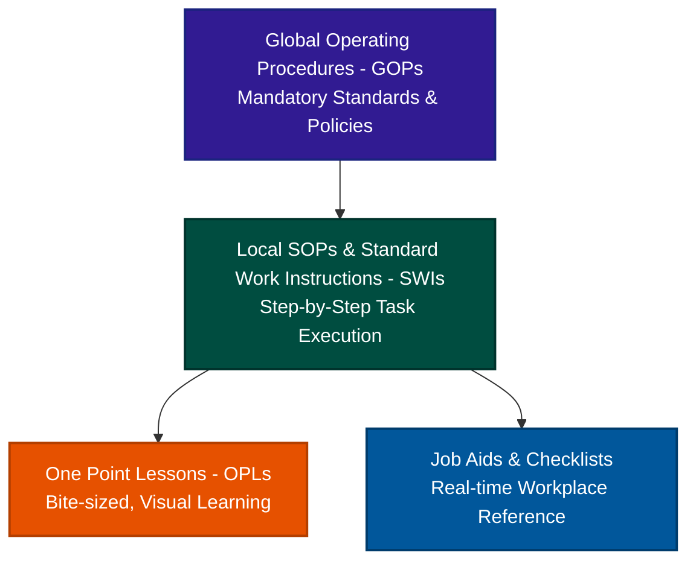

# AB InBev Process Documentation Ecosystem: Actionable Blueprint

This blueprint breaks down the exact methodologies Anheuser-Busch InBev (AB InBev) uses to document, audit, and improve processes under their Voyager Plant Optimization (VPO) system. It outlines how to translate these enterprise-level practices into a lean, actionable framework for your own company.

---

## 1. The Documentation Hierarchy

AB InBev avoids the common pitfall of having single, massive manuals. Instead, they divide process documentation into four distinct layers, separating high-level policy from shop-floor execution.

### Layer 1: Global Operating Procedures (GOPs)
*   **What it is:** Corporate-level policies outlining global standards (e.g., global safety rules, water usage targets, core quality metrics).
*   **Target Audience:** Plant managers, department heads, and compliance auditors.
*   **Role:** Defines the **"what"** and the high-level **"why."**

### Layer 2: Local SOPs & Standard Work Instructions (SWIs)
*   **What it is:** Detailed, local step-by-step procedures for specific machinery, software systems, or workflows (e.g., *"CIP - Cleaning-in-Place for Fermentation Tank 3"*).
*   **Target Audience:** Frontline operators and technicians.
*   **Role:** Defines the **"who,"** **"when,"** and **"how"** in sequential detail. Contains safety warnings, required tools/materials, exact settings, and quality parameters.

### Layer 3: One Point Lessons (OPLs)
*   **What it is:** A highly visual, single-page training document focusing on **exactly one concept**. The golden rule of an OPL is: **90% visuals/photos, 10% text**, and it must be readable in under 5 minutes.
*   **Three Types of OPLs:**
    1.  *Basic Info:* How a specific valve or setting works.
    2.  *Troubleshooting/Improvement:* How to fix a common error or a new technique developed by an operator.
    3.  *Safety:* Visual warning of a specific hazard in an area.
*   **Role:** Quick training, knowledge sharing, and highlighting specific steps in an SOP that are frequently done incorrectly.

### Layer 4: Job Aids & Workstation Checklists
*   **What it is:** Visual references placed at the point of action (e.g., a laminated startup checklist on the machine, a color-coded pipe diagram, a quick-reference chart for pressure settings).
*   **Role:** Memory joggers used **during** the task. They are not training manuals but quick visual checklists to prevent slips and lapses.

---

## 2. Key Operational Principles Behind the System

For documentation to work, it must be supported by a culture that prevents documents from becoming "dusty folders on a shelf." AB InBev achieves this through three core principles:

### I. "No Check Without Consequence" (Actionable Quality)
Checking a parameter is useless if the operator doesn't know what to do when it is wrong. 
*   **The Rule:** For every quality check, inspection, or checklist item, there must be a clearly defined **reaction plan** (consequence) if it fails.
*   *Example:* If a temperature check yields >18°C, the SOP must state: *"Stop the line, isolate batch X, adjust coolant valve by 2 turns, and log an abnormality."* If there is no action tied to a measurement, VPO removes the check entirely to eliminate waste.

### II. Operational Work Diagnosis (OWD) — The Audit Loop
Instead of auditing paperwork, AB InBev audits the human executing the process.
*   **What it is:** A structured observation where a supervisor or peer expert stands next to an operator and watches them perform a task according to the SOP.
*   **Objective:**
    *   Is the operator following the SOP? (Standard compliance).
    *   Is the SOP actually correct and efficient, or has the process changed? (SOP validity).
    *   Provide immediate on-the-job coaching to close skill gaps.
*   If deviations are found, they either result in retraining the operator or updating the SOP if the operator has found a better, safer way to work.

### III. The SDCA $\rightarrow$ PDCA Cycle
Process improvement must follow a standard loop:
1.  **Standardize** the work (SOP/Job Aid).
2.  **Do** the work.
3.  **Check** the results against KPIs.
4.  **Act** to correct anomalies (using **SDCA** to maintain stability).
5.  If a KPI needs to be permanently improved, initiate a **PDCA** cycle (Root Cause Analysis, Kaizen) to find a better way, and then document that new way as the updated SOP.

---

## 3. Digital Control & Point-of-Use Access

Keeping documentation updated globally requires strict governance:
*   **Single Source of Truth:** All official SOPs, OPLs, and checklists are stored digitally in a central portal.
*   **Governance Workflow:** An operator can write an OPL, but it must be approved by the Department Head and Quality Lead before it is published.
*   **Point-of-Use Lamination:** When documents are printed and laminated for the shop floor, they must be audited regularly (e.g., during monthly 5S audits) to ensure the physical version matches the version code in the digital portal.

---

## 4. How to Apply This to Your Company: Step-by-Step

Here is a step-by-step implementation guide to adapt AB InBev's methodology for your company:

### Step 1: Simplify Your Document Structure
Stop writing 50-page manuals. Split your documentation into three levels:
1.  **SOPs:** 2–5 pages max, focusing on step-by-step instructions with photos.
2.  **OPLs:** Single-page visual sheets for individual tasks, common errors, or machine settings.
3.  **Checklists:** Short list of checkpoints with checkboxes for daily routines.

### Step 2: Establish the "No Check Without Consequence" Rule
Review your current logs, forms, and checklists:
*   Identify every data point your employees currently write down or check.
*   Ask: *"If this value is out of bounds, what is the exact action the employee takes?"*
*   If there is no written reaction plan, add it directly to the form/SOP (e.g., *"If status is RED, contact supervisor at ext. 555 and halt production"*). If no action is necessary, stop collecting the data.

### Step 3: Implement the OPL (One Point Lesson) Program
Empower your team to document their own knowledge:
*   Create a simple PowerPoint template for OPLs (landscape orientation, large photo box on the left, 3–5 bullet points of text on the right, header with author, date, and ID).
*   Encourage operators or team leads to write an OPL whenever they find a "trick of the trade," a common mistake, or a safety warning.
*   Set up a quick review system (e.g., manager signs off on the OPL) and pin it directly at the workstation.

### Step 4: Schedule "Process Diagnoses" (OWD)
Make process audits part of your managers' routines:
*   Create a monthly schedule where supervisors must spend 15–30 minutes observing one employee perform a specific SOP.
*   Use a simple 4-point checklist for the supervisor:
    1.  *Did the employee follow the steps in order?* (Yes/No)
    2.  *Did the employee use the correct tools and safety gear?* (Yes/No)
    3.  *Are there steps in the SOP that are outdated or unnecessary?* (Yes/No)
    4.  *Coaching feedback provided:* [Notes]
*   Use these diagnoses to keep SOPs alive and continuously updated.

### Step 5: Implement Point-of-Use Visuals
Ensure documentation is visible where the work happens:
*   Instead of keeping SOPs in a binder in an office, laminate the step-by-step guide and attach it directly to the machine or desk.
*   Use color-coding (e.g., red tags for safety steps, green for quality checks).
*   Add QR codes to laminated guides that link directly to the digital version or a short video demonstrating the task.
