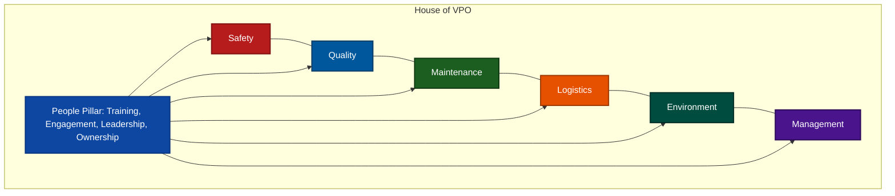

# AB InBev Voyager Plant Optimization (VPO) System Analysis

Voyager Plant Optimization (VPO) is Anheuser-Busch InBev’s (AB InBev) proprietary, integrated global management system. It serves as the operational "operating system" designed to standardize procedures, improve safety, enforce quality, optimize costs, and drive continuous improvement across its breweries, vertical operations, and supply chain.

---

## 1. Core Philosophy and Strategic Alignment

VPO is not just a collection of technical manuals; it is strategically aligned with AB InBev’s broader corporate culture:

*   **Standardization & Repeatability:** Provides a single, unified framework to manage complex brewery operations globally. This ensures that a brewery in Belgium, the US, or Brazil follows the same high-performance guidelines.
*   **"Best of Both" Integration:** Following the acquisition of SABMiller, AB InBev updated the VPO system by combining it with SABMiller’s **GEM (Global Evaluation of Manufacturing)** system. This integration significantly enhanced shop-floor engagement, autonomous maintenance routines, and technical reliability.
*   **Operator Empowerment:** Shifting accountability from high-level managers down to shop-floor operators. Operators are trained to monitor their own KPIs, identify anomalies, and perform autonomous maintenance.
*   **Competitive Advantage:** The repeatable architectural model of VPO allows AB InBev to rapidly integrate newly acquired breweries, aligning them to company standards and scaling operations efficiently.

---

## 2. The 7 Pillars of the VPO House

VPO is structurally represented as a "House," where the **People** pillar forms the foundation, and the other six pillars represent specific focus areas of plant operations:

### I. People (The Foundation)
*   **Focus:** Training, development, knowledge sharing, leadership, and engagement.
*   **Purpose:** Fosters a culture of employee ownership and continuous improvement. It ensures that workers have the correct skills, tools, and motivation to maintain and improve operational standards.

### II. Management
*   **Focus:** Core routines, meeting structures, goal-setting, and KPI tracking.
*   **Purpose:** The engine of the VPO system. It defines the operational rhythm (daily, weekly, monthly routines) and ensures that all other pillars function effectively.

### III. Safety
*   **Focus:** Behavior-based safety, risk reduction, hazard identification, and incident reporting.
*   **Purpose:** A non-negotiable commitment ("Safety First"). It aims to build a zero-accident workplace by proactively identifying risks and changing unsafe behaviors.

### IV. Quality
*   **Focus:** Standard operating procedures, food safety, consistency, sensory flavor programs, and traceability.
*   **Purpose:** Ensures that the final product adheres to strict specifications ("Quality Always") from raw materials to delivery.

### V. Maintenance
*   **Focus:** Equipment reliability, preventive/planned maintenance, and Autonomous Maintenance (AM).
*   **Purpose:** Heavily utilizes Total Productive Maintenance (TPM) to maximize Overall Equipment Effectiveness (OEE) and minimize process losses and unscheduled downtime.

### VI. Logistics
*   **Focus:** Material handling, storage, inventory management, packaging lines, and warehouse distribution.
*   **Purpose:** Links brewery operations to the outer supply chain, optimizing cost, safety, and delivery service levels.

### VII. Environment
*   **Focus:** Natural resource management (water and energy conservation), legal compliance, and waste reduction.
*   **Purpose:** Directs facilities toward sustainability goals, such as reducing water usage per hectoliter of beer brewed and achieving zero waste to landfill.

---

## 3. Underlying Methodologies and Principles

VPO integrates several industry-standard continuous improvement methodologies into a cohesive system:

*   **Total Productive Maintenance (TPM):** Operators are trained in autonomous maintenance (cleaning, lubricating, inspecting, and tightening equipment) to shift from reactive firefighting to proactive prevention.
*   **Lean & Six Sigma:** Focusing on maximizing value by systematically eliminating waste (*Muda*) and reducing process variation to achieve highly predictable, repeatable results.
*   **5S Workplace Organization:** Sort (*Seiri*), Set in Order (*Seiton*), Shine (*Seiso*), Standardize (*Seiketsu*), and Sustain (*Shitsuke*). 5S is a fundamental step to organizing work areas, improving safety, and making operational abnormalities visually obvious.
*   **The PDCA and SDCA Cycles:**
    *   **SDCA (Standardize, Do, Check, Act):** Used to maintain the current state. When operations are running normally, teams adhere to established Standard Operating Procedures (SOPs) and verify that inputs match expected outputs.
    *   **PDCA (Plan, Do, Check, Act):** Used for continuous improvement (*Kaizen*). When the team wants to improve a metric or solve a persistent deviation, they plan an intervention, execute it, check the results, and act to standardize the change if successful.

---

## 4. Process Management Routines & Problem-Solving Tools

To manage processes on a daily basis, VPO employs specific cascading routines and standard tools:

### I. Cascading Tiered Meeting Structure
Management routines establish a communication hierarchy that connects strategic goals to shift execution:

| Meeting Level | Focus & Rhythm | Key Participants |
| :--- | :--- | :--- |
| **Tier 1** (Shop Floor / Line) | Immediate safety, quality results, shift output, and escalations. Conducted daily at the start/end of shifts. | Frontline operators, technicians, and team leads. |
| **Tier 2** (Department / Area) | 24-hour performance review, resource needs, and addressing issues escalated from Tier 1. Conducted daily. | Area supervisors, process engineers, and area managers. |
| **Tier 3** (Brewery / Plant) | Long-term KPIs, strategic goal alignment, capital/cost management, and plant-wide safety. Conducted weekly or monthly. | Brewery Manager and Department Heads (Quality, Logistics, Maintenance). |

### II. Abnormality Management
When a metric deviates from the target (an "abnormality"), it is immediately recorded on visual control boards. Teams track:
1.  **What** happened (description of abnormality).
2.  **Immediate Containment Action** (what was done to temporarily keep operations running).
3.  **Root Cause Analysis (RCA)** progress.
4.  **Action Plan** to prevent recurrence.

### III. Root Cause Analysis (RCA) Tools
To ensure problems are permanently solved rather than temporarily patched:
*   **5 Whys:** A simple, iterative interrogative technique to drill down from symptoms to the underlying root cause.
*   **Ishikawa (Fishbone) Diagram:** Categorizes potential causes of complex process deviations into six main groups: *People, Machine, Material, Method, Measurement, and Environment (5M1E)*.

### IV. One Point Lessons (OPLs)
A visual, single-page training document. OPLs are used to transfer knowledge rapidly on a specific topic:
*   **Basic Information:** How a machine works.
*   **Abnormality/Improvement:** How a specific problem was fixed and how to avoid it.
*   **Safety:** Safe working methods for a particular task.

---

## 5. Auditing, Certification, and Benchmarking

To ensure accountability and drive compliance, AB InBev uses a structured evaluation process:

*   **VPO Qualification Audit:** Plants undergo external audits by global or regional teams (taking 6–9 months to complete a full cycle).
*   **Certification Levels:** Facilities are certified in levels of operational maturity:
    *   **Bronze / Entry Level:** Basic procedures and VPO standards are implemented, and safety/quality baselines are stabilized.
    *   **Silver / Intermediate Level:** TPM and lean routines are mature; data is systematically used to prevent losses, and benchmarking is established.
    *   **Gold / Advanced Level:** High performance across all pillars, close-to-zero losses, strong sustainability metrics, and autonomous team operation.
    *   **World Class Level:** Industry-leading performance, continuous innovation, and serving as a model plant for the global network.
*   **Benchmarking Competition:** KPIs (such as water usage, energy consumption, and OEE) are compared globally, encouraging plants to compete for best-in-class status and motivating teams through recognition and best-practice sharing.
