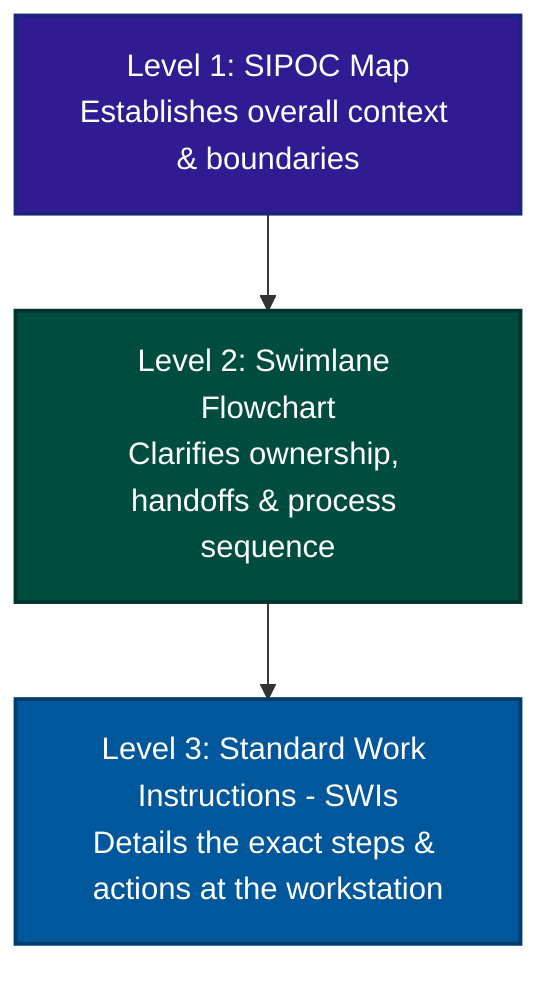

# Guidelines for Designing Effective Process Workflows and Forms

This guide provides concrete, actionable best practices for documenting process workflows and designing forms (logs, checklists, control sheets) to ensure standards are easy to follow, simple to audit, and highly visual.

---

## Part 1: Effectively Describing Process Workflows

A workflow description must bridge the gap between "what happens" (the system view) and "how to do it" (the operator view). Use the following three-layer mapping approach and text guidelines.

### 1. The Three-Layer Mapping Method
Do not describe a workflow as a massive wall of text. Break it down using these three visual layers:



*   **Level 1: SIPOC (Supplier, Input, Process, Output, Customer)**
    *   *Purpose:* Define the start and end points of a workflow.
    *   *Rule:* Keep it to 5–7 high-level process steps. Avoid micro-details.
*   **Level 2: Cross-Functional Swimlanes**
    *   *Purpose:* Show sequence and handoffs.
    *   *Rule:* Each lane represents a role (e.g., Warehouse Operator, Shift Lead, Lab Tech). A decision diamond should only be used when the path splits based on a metric or check.
*   **Level 3: Standard Work Instructions (SWIs)**
    *   *Purpose:* Show the step-by-step actions of a single operator at a specific machine.
    *   *Rule:* Pair every text instruction with a corresponding photo or diagram.

---

### 2. Best Practices for Writing Workflow Steps
When writing the actual steps within an SOP or SWI, follow these linguistic standards:

*   **The Action-Target Formula:** Write steps using the **[Verb] + [Noun] + [Target/Value]** structure.
    *   *Incorrect:* "The operator should check the temperature of the coolant and make sure it is not too hot."
    *   *Correct:* **"Verify (Verb) coolant temperature (Noun) is below 15°C (Target)."**
*   **Use Active Voice:** Always tell the user exactly what to do.
    *   *Incorrect:* "The red button is pressed to halt the conveyor."
    *   *Correct:* **"Press (Active Verb) the red button to halt the conveyor."**
*   **Embed the "Why" (The Reason):** If a step requires specific care, explain why it matters. This increases compliance.
    *   *Example:* *"Tighten the filter cap clockwise until the indicator lines align **[Why: to prevent chemical leakage and pressure loss]**."*

---

## Part 2: Designing Effective Operational Forms

An operational form (such as a checklist, inspection log, or shift check-sheet) is a workflow's validation loop. Good forms prevent errors, ensure accountability, and make abnormalities visible at a glance.

### 1. The Golden Rules of Form Design

#### Rule I: "At-a-Glance" Status Check
An auditor or supervisor should be able to walk up to a workstation, look at the form, and know in **under 1 second** if the process is currently normal or abnormal.
*   **Practice:** Use color-coded target zones. Instead of asking the operator to write a raw number and leave it at that, print the acceptable range directly on the form and use colored borders or shading.

#### Rule II: Integrated Reaction Protocol (No Check Without Consequence)
A form should never just record a failure; it must guide the reaction.
*   **Practice:** Next to every check, include an explicit "If Out of Spec" column, or place a reaction block at the bottom of the page.
*   *Example:* If checking pressure, the form should display:
    *   *Target:* 2.0 - 2.5 bar.
    *   *Reaction:* If $< 2.0$ bar, open primary regulator. If $> 2.5$ bar, bleed line and notify lead.

#### Rule III: Physical/Digital Alignment
If operators fill out paper forms, make them easy to handle.
*   **Practice:** Use clipboard-friendly layouts, large checkboxes, and robust materials (e.g., laminated sheets with dry-erase markers). If digital, use dropdowns and red/green visual alerts.

---

### 2. Standard Structural Template for an Operational Form

A lean, VPO-compliant form consists of five core zones:

```
+-------------------------------------------------------------------------+
| ZONE 1: Header (Form Name, ID, Rev #, Date, Shift, Operator)            |
+-------------------------------------------------------------------------+
| ZONE 2: Core Checks Table                                               |
| [Check Item] | [Frequency] | [Spec/Range] | [Value] | [Status (P/F)]    |
+-------------------------------------------------------------------------+
| ZONE 3: Reaction Protocols (Action to take if any Check status is FAIL) |
+-------------------------------------------------------------------------+
| ZONE 4: Abnormality Log (Record: Time, Abnormality, Action taken, Sign) |
+-------------------------------------------------------------------------+
| ZONE 5: Verification & Sign-off (Supervisor daily review block)         |
+-------------------------------------------------------------------------+
```

---

## Part 3: Practical Form Templates

Below are two layout templates you can copy and adapt for your team.

### Template A: Visual Daily Equipment Checklist (Pre-Start)

This form is placed at the machine. It forces the operator to run basic checks before turning on the power.

| Check Item | Visual Location Code | Target / Safe Condition | Actual State | Status | Immediate Reaction Protocol (If FAIL) |
| :--- | :---: | :--- | :---: | :---: | :--- |
| **1. Emergency Stop** | `ES-01` | Button is released and functional. | [ ] | Pass / Fail | Do not start. Tag out machine and contact Maintenance. |
| **2. Hydraulic Pressure** | `PG-02` | Pointer is within the **Green Zone** (150-180 bar). | `______` bar | Pass / Fail | Adjust pump valve B. If pressure remains low, halt startup. |
| **3. Machine Cleanliness** | `5S-Area` | Workspace free of oil leaks, debris, and tools. | [ ] | Pass / Fail | Execute 5S cleaning routine before starting. |
| **4. Safety Guard** | `SG-01` | Interlock guard closed and locked. | [ ] | Pass / Fail | Adjust alignment. If interlock fails to engage, contact Lead. |

---

### Template B: Process Abnormality Log

This log is used to capture deviations as they happen and document the containment/RCA loop.

*   **Form ID:** `LOG-AB-01` | **Revision:** `v1.2` | **Location:** `Packaging Line A`

| Date & Time | Operator | Description of Abnormality (Deviation from Standard) | Immediate Containment Action (Stop-gap Fix) | Root Cause Code (or 5-Why Run) | Permanent Action / SOP Update Needed? | Supervisor Sign-off |
| :--- | :--- | :--- | :--- | :---: | :--- | :---: |
| *09/06 14:05* | *T. Rand* | *Cap feeding chute jammed; halted conveyor.* | *Cleared stuck cap; wiped chute with alcohol.* | *M-03 (Dirt/Build-up)* | *Add weekly chute wipe down to SOP-04.* | *J. Doe (15:00)* |
| | | | | | | |
| | | | | | | |

---

## Summary Checklist for Process Leaders

When reviewing workflows and forms, ask yourself these 5 questions:
1.  **Can a temporary worker read this SOP** and complete the task correctly without asking for help?
2.  **Does every checkpoint on the checklist** have a corresponding "reaction action" in writing?
3.  **Is the form located physically at the work center**, or is it stored in an office drawer?
4.  **Are visuals/photos used for at least 50%** of the instruction steps?
5.  **Does the form include a clear block** for supervisor signature verification?
